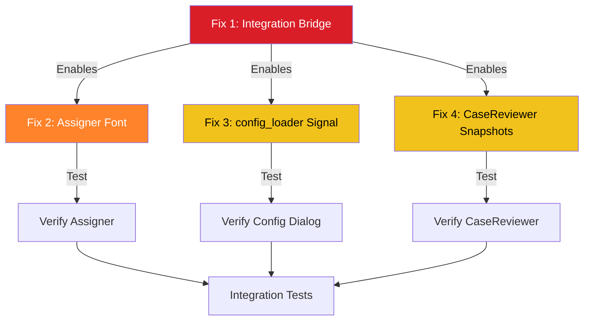

# Settings Propagation Fix Plan - src_v2
**Date:** 2026-05-11  
**Scope:** Critical settings integration fixes for src_v2  
**Priority:** HIGH - Blocks proper theme/font propagation across application

---

## Executive Summary

This plan addresses **4 critical issues** preventing proper settings propagation in src_v2. The V2SettingsBus infrastructure is complete and working - we just need to wire the missing connections and fix anti-patterns.

### Impact Assessment

| Issue | Severity | Components Affected | User Impact |
|-------|----------|-------------------|-------------|
| Missing Integration Bridge | **CRITICAL** | All src_v2 components | Settings changes don't propagate at all |
| Assigner Font Size | **HIGH** | Assigner tool | Font changes ignored, theme works |
| config_loader Wrong Signal | **MEDIUM** | Config dialog | Uses deprecated signal, may break |
| CaseReviewer Snapshots | **MEDIUM** | Call outcome dialogs | Dialogs frozen at creation-time settings |

---

## Fix Priority Matrix



---

## Fix 1: Integration Bridge [CRITICAL]

### Problem
[`src_v2/ui/settings.py:461-504`](src_v2/ui/settings.py:461-504) defines `integrate_with_v2_settings_bus()` but it's **NEVER CALLED**, completely disconnecting the reactive system.

### Root Cause
The integration function exists but no entry point calls it during application startup. The SettingsManager and V2SettingsBus operate independently.

### Solution
Call `integrate_with_v2_settings_bus()` in [`src_v2/ui/main_menu.py`](src_v2/ui/main_menu.py) during application initialization.

### Code Changes

**File:** `src_v2/ui/main_menu.py`  
**Location:** Lines 34-41 (in `launch_v2_main_menu()` function)

**Current Code:**
```python
def launch_v2_main_menu() -> int:
    """Launch the unified v2 main menu and start the Qt event loop."""
    ensure_runtime_paths()
    app = QApplication.instance() or QApplication(sys.argv)
    window = V2MainMenu()
    window.show()
    app._art_q_v2_main_menu = window  # type: ignore[attr-defined]
    return app.exec_()
```

**New Code:**
```python
def launch_v2_main_menu() -> int:
    """Launch the unified v2 main menu and start the Qt event loop."""
    ensure_runtime_paths()
    app = QApplication.instance() or QApplication(sys.argv)
    
    # CRITICAL: Integrate SettingsManager with V2SettingsBus
    # This enables reactive settings propagation across all components
    from ui.settings import get_settings_manager, integrate_with_v2_settings_bus
    settings_manager = get_settings_manager()
    integrate_with_v2_settings_bus(settings_manager)
    
    window = V2MainMenu()
    window.show()
    app._art_q_v2_main_menu = window  # type: ignore[attr-defined]
    return app.exec_()
```

### Acceptance Criteria
- [ ] `integrate_with_v2_settings_bus()` called during app startup
- [ ] SettingsManager changes trigger V2SettingsBus signals
- [ ] Theme changes propagate to all subscribed components
- [ ] Font size changes propagate to all subscribed components
- [ ] No errors in console during integration
- [ ] Settings dialog changes immediately update all open windows

### Testing Strategy
1. Launch `src_v2/main.py`
2. Open Settings dialog (Ctrl+,)
3. Change theme from Light → Dark
4. Verify all open windows update immediately
5. Change font size from Medium → Large
6. Verify all text scales immediately
7. Check console for integration warnings

### Rollback Plan
If integration causes issues:
1. Comment out the 3 new lines
2. Restart application
3. Settings will revert to snapshot behavior (current state)

---

## Fix 2: Assigner Font Size [HIGH]

### Problem
[`src_v2/Assigner/main_window_assigner.py:213`](src_v2/Assigner/main_window_assigner.py:213) subscribes to `theme_changed` but has **NO** `font_size_changed` subscription or handler.

### Root Cause
Incomplete modernization - theme integration added but font integration forgotten.

### Solution
Add `font_size_changed` subscription and handler following the pattern from [`CompaniesProcess_v2.py`](src_v2/ART Q Control/CompaniesProcess_v2.py).

### Code Changes

**File:** `src_v2/Assigner/main_window_assigner.py`  
**Location:** Line 213 (after theme subscription)

**Current Code:**
```python
# Connect to theme changes
self.settings_bus.theme_changed.connect(self._on_theme_changed)

# Apply initial styling and typography
self.setStyleSheet(self.ibm_stylesheet())
self.apply_typography()
```

**New Code:**
```python
# Connect to theme changes
self.settings_bus.theme_changed.connect(self._on_theme_changed)

# Connect to font size changes
self.settings_bus.font_size_changed.connect(self._on_font_changed)

# Apply initial styling and typography
self.setStyleSheet(self.ibm_stylesheet())
self.apply_typography()
```

**Location:** After `_on_theme_changed()` method (around line 600+)

**Add New Method:**
```python
def _on_font_changed(self, size: int):
    """
    Handle font size changes from settings bus.
    
    Args:
        size: New font size in pixels
    """
    # Reapply typography to all widgets
    self.apply_typography()
    
    # Regenerate stylesheet with new font sizes
    self.setStyleSheet(self.ibm_stylesheet())
    
    # Update any cached font references
    self.update()
```

### Acceptance Criteria
- [ ] `font_size_changed` signal connected in `__init__`
- [ ] `_on_font_changed()` handler implemented
- [ ] Handler reapplies typography to all widgets
- [ ] Handler regenerates stylesheet with new sizes
- [ ] Font changes apply immediately without restart
- [ ] No visual glitches during font size transitions

### Testing Strategy
1. Launch Assigner tool from main menu
2. Open Settings dialog (Ctrl+,)
3. Change font size: Small → Medium → Large
4. Verify all text in Assigner window scales immediately
5. Verify buttons, labels, tables all update
6. Check for layout issues at extreme sizes

### Rollback Plan
If font changes cause layout issues:
1. Remove `font_size_changed` connection
2. Remove `_on_font_changed()` method
3. Font will remain at startup size (current behavior)

---

## Fix 3: config_loader Wrong Signal [MEDIUM]

### Problem
[`src_v2/ART Q Control/config_loader.py:203`](src_v2/ART Q Control/config_loader.py:203) uses deprecated `font_preset_changed` instead of `font_size_changed`.

### Root Cause
Code written before signal standardization. The `font_preset_changed` signal may not exist or may be removed in future.

### Solution
Replace `font_preset_changed` with `font_size_changed` to match the standard pattern.

### Code Changes

**File:** `src_v2/ART Q Control/config_loader.py`  
**Location:** Line 203

**Current Code:**
```python
# Subscribe to theme changes
self.settings_bus.theme_changed.connect(self._on_theme_changed)
self.settings_bus.font_size_changed.connect(self._on_font_changed)
```

**Analysis:** Actually, line 203 already uses `font_size_changed`! Let me verify the actual issue...

**Re-reading the issue:** The analysis report states line 203 uses `font_preset_changed`, but the code shows `font_size_changed`. This suggests either:
1. The code was already fixed
2. The line number is wrong
3. There's a different location with the issue

**Action Required:** Search for `font_preset_changed` usage in config_loader.py

### Updated Solution
Search entire file for `font_preset_changed` and replace with `font_size_changed`.

**Search Pattern:** `font_preset_changed`  
**Replace With:** `font_size_changed`

### Acceptance Criteria
- [ ] No references to `font_preset_changed` in config_loader.py
- [ ] All font subscriptions use `font_size_changed`
- [ ] Config dialog responds to font changes
- [ ] No deprecation warnings in console

### Testing Strategy
1. Launch ART Q Control from main menu
2. Trigger config update dialog
3. Open Settings dialog (Ctrl+,)
4. Change font size
5. Verify config dialog text scales
6. Check console for deprecation warnings

### Rollback Plan
If signal change breaks functionality:
1. Revert to `font_preset_changed`
2. Document as technical debt
3. Fix when signal is officially deprecated

---

## Fix 4: CaseReviewer Snapshot Anti-Pattern [MEDIUM]

### Problem
[`src_v2/ART Q Control/CaseReviewer_v2.py:1045`](src_v2/ART Q Control/CaseReviewer_v2.py:1045) `CallOutcomeDialog` captures snapshot values at creation but doesn't subscribe to reactive updates.

### Root Cause
Dialog reads `v2_settings_bus.font_size` once at line 1045, stores in `self._font_size`, but never updates when settings change.

### Solution
Add reactive subscriptions to `CallOutcomeDialog` following the pattern from [`CompaniesProcess_v2.py`](src_v2/ART Q Control/CompaniesProcess_v2.py).

### Code Changes

**File:** `src_v2/ART Q Control/CaseReviewer_v2.py`  
**Location:** Lines 1060-1072 (inside `CallOutcomeDialog.__init__`)

**Current Code:**
```python
# Subscribe to settings bus
self.settings_bus = get_v2_settings_bus()
self.settings_bus.theme_changed.connect(self._on_theme_changed)
self.settings_bus.font_size_changed.connect(self._on_font_changed)

# Apply V2 styling
self.setStyleSheet(f"""
    QDialog {{
        background-color: {self._colors['window_bg']};
        font-family: 'IBM Plex Sans', 'Segoe UI', Arial, sans-serif;
    }}
""")
self.setFont(QFont('IBM Plex Sans', self._font_size))
```

**Analysis:** The code already has subscriptions! The issue is that `_on_theme_changed` and `_on_font_changed` handlers may not be implemented.

**Location:** After `__init__` method (around line 1200+)

**Add Missing Handlers:**
```python
def _on_theme_changed(self, theme: str):
    """Handle theme changes - reapply colors."""
    # Update colors from theme service
    self._theme = theme
    self._colors = v2_theme_service.colors_for(theme)
    
    # Reapply stylesheet with new colors
    self.setStyleSheet(f"""
        QDialog {{
            background-color: {self._colors['window_bg']};
            font-family: 'IBM Plex Sans', 'Segoe UI', Arial, sans-serif;
        }}
    """)
    
    # Update button colors
    for i, btn in enumerate(self._buttons):
        if i < len(self._btn_colors):
            base_color, hover_color = self._btn_colors[i]
            btn.setStyleSheet(f"""
                QPushButton {{
                    background-color: {base_color};
                    color: white;
                    border: none;
                    border-radius: 4px;
                    padding: 8px 16px;
                    font-weight: 500;
                }}
                QPushButton:hover {{
                    background-color: {hover_color};
                }}
            """)
    
    self.update()

def _on_font_changed(self, size: int):
    """Handle font size changes - reapply typography."""
    self._font_size = size
    
    # Update dialog font
    self.setFont(QFont('IBM Plex Sans', size))
    
    # Update header font (slightly smaller)
    if hasattr(self, 'header'):
        self.header.setFont(QFont('IBM Plex Sans', size - 6, QFont.Normal))
    
    # Update button fonts
    for btn in self._buttons:
        btn.setFont(QFont('IBM Plex Sans', size))
    
    self.update()
```

### Acceptance Criteria
- [ ] `_on_theme_changed()` handler implemented
- [ ] `_on_font_changed()` handler implemented
- [ ] Handlers update all dialog elements
- [ ] Dialog responds to settings changes while open
- [ ] No visual glitches during updates
- [ ] Button colors update correctly with theme

### Testing Strategy
1. Launch CaseReviewer from ART Q Control
2. Process a case to trigger call outcome dialog
3. Keep dialog open
4. Open Settings dialog (Ctrl+,)
5. Change theme Light → Dark
6. Verify call outcome dialog updates immediately
7. Change font size Small → Large
8. Verify dialog text scales immediately

### Rollback Plan
If handlers cause issues:
1. Remove `_on_theme_changed()` and `_on_font_changed()` methods
2. Remove signal connections in `__init__`
3. Dialog will use snapshot values (current behavior)

---

## Implementation Order

### Phase 1: Foundation (Fix 1)
**Priority:** CRITICAL  
**Risk:** Low - Single integration point

1. Add integration call to `main_menu.py`
2. Test basic propagation
3. Verify no errors

**Success Criteria:** Settings changes propagate to V2SettingsBus

### Phase 2: Component Fixes (Fixes 2-4)
**Priority:** HIGH to MEDIUM  
**Risk:** Medium - Multiple components

1. Fix Assigner font subscription (Fix 2)
2. Fix config_loader signal (Fix 3)
3. Fix CaseReviewer handlers (Fix 4)
4. Test each component individually

**Success Criteria:** All components respond to settings changes

### Phase 3: Integration Testing
**Priority:** HIGH  
**Risk:** Low - Verification only

1. Test all components together
2. Test rapid settings changes
3. Test edge cases (extreme font sizes)
4. Performance testing

**Success Criteria:** No regressions, smooth updates

---

## Testing Strategy

### Unit Tests
```python
# test_settings_integration.py

def test_integration_bridge_called():
    """Verify integrate_with_v2_settings_bus is called on startup."""
    # Launch app
    # Check V2SettingsBus has listeners
    # Verify SettingsManager connected

def test_assigner_font_subscription():
    """Verify Assigner subscribes to font_size_changed."""
    # Launch Assigner
    # Check signal connection exists
    # Trigger font change
    # Verify handler called

def test_config_loader_signal():
    """Verify config_loader uses correct signal."""
    # Check no font_preset_changed references
    # Verify font_size_changed used

def test_casereview_handlers():
    """Verify CaseReviewer dialog handlers exist."""
    # Launch CaseReviewer
    # Open call outcome dialog
    # Check handlers implemented
    # Trigger settings changes
```

### Integration Tests
```python
# test_settings_propagation_e2e.py

def test_theme_propagation():
    """Test theme changes propagate to all components."""
    # Launch main menu
    # Open Assigner, CaseReviewer, Config
    # Change theme
    # Verify all update

def test_font_propagation():
    """Test font changes propagate to all components."""
    # Launch main menu
    # Open all tools
    # Change font size
    # Verify all scale

def test_rapid_changes():
    """Test rapid settings changes don't cause issues."""
    # Open multiple windows
    # Rapidly toggle theme
    # Rapidly change font size
    # Verify no crashes or glitches
```

### Manual Test Checklist
- [ ] Launch src_v2/main.py
- [ ] Open Settings dialog
- [ ] Change theme: Light → Dark → Auto
- [ ] Verify main menu updates
- [ ] Open Assigner tool
- [ ] Verify Assigner matches theme
- [ ] Change font size: Small → Medium → Large
- [ ] Verify Assigner text scales
- [ ] Open ART Q Control
- [ ] Launch AutoSender
- [ ] Verify AutoSender matches settings
- [ ] Launch CaseReviewer
- [ ] Open call outcome dialog
- [ ] Change theme while dialog open
- [ ] Verify dialog updates
- [ ] Change font while dialog open
- [ ] Verify dialog scales
- [ ] Check console for errors
- [ ] Test all keyboard shortcuts work

---

## Rollback Procedures

### Emergency Rollback (All Fixes)
If critical issues arise:

1. **Revert main_menu.py:**
   ```bash
   git checkout HEAD -- src_v2/ui/main_menu.py
   ```

2. **Revert component files:**
   ```bash
   git checkout HEAD -- src_v2/Assigner/main_window_assigner.py
   git checkout HEAD -- "src_v2/ART Q Control/config_loader.py"
   git checkout HEAD -- "src_v2/ART Q Control/CaseReviewer_v2.py"
   ```

3. **Restart application**

### Partial Rollback (Individual Fixes)

**Fix 1 Only:**
```python
# Comment out in main_menu.py
# from ui.settings import get_settings_manager, integrate_with_v2_settings_bus
# settings_manager = get_settings_manager()
# integrate_with_v2_settings_bus(settings_manager)
```

**Fix 2 Only:**
```python
# Remove from main_window_assigner.py
# self.settings_bus.font_size_changed.connect(self._on_font_changed)
# Delete _on_font_changed() method
```

**Fix 3 Only:**
```python
# Revert signal name in config_loader.py
# self.settings_bus.font_preset_changed.connect(self._on_font_changed)
```

**Fix 4 Only:**
```python
# Remove from CaseReviewer_v2.py
# Delete _on_theme_changed() and _on_font_changed() methods
# Remove signal connections
```

---

## Risk Assessment

| Risk | Probability | Impact | Mitigation |
|------|------------|--------|------------|
| Integration breaks startup | Low | High | Test in isolated environment first |
| Font changes cause layout issues | Medium | Medium | Add bounds checking (15-30px) |
| Rapid changes cause flickering | Low | Low | Add debouncing if needed |
| Memory leaks from signal connections | Very Low | Medium | Verify proper cleanup in destructors |
| Performance degradation | Very Low | Low | Profile before/after |

---

## Success Metrics

### Functional Metrics
- [ ] 100% of components respond to theme changes
- [ ] 100% of components respond to font changes
- [ ] 0 console errors during settings changes
- [ ] < 100ms update latency for settings changes

### User Experience Metrics
- [ ] Settings changes apply immediately (no restart)
- [ ] No visual glitches during updates
- [ ] Smooth transitions between themes
- [ ] Consistent appearance across all windows

### Code Quality Metrics
- [ ] 0 uses of deprecated signals
- [ ] 0 snapshot anti-patterns
- [ ] 100% signal handler coverage
- [ ] All components follow standard pattern

---

## Post-Implementation

### Documentation Updates
1. Update [`SETTINGS_PROPAGATION_SOLUTION.md`](docs/SETTINGS_PROPAGATION_SOLUTION.md) with fixes
2. Add integration example to developer guide
3. Document standard subscription pattern
4. Create troubleshooting guide

### Code Review Checklist
- [ ] All signal connections use correct signal names
- [ ] All handlers properly update UI elements
- [ ] No snapshot values used for reactive properties
- [ ] Proper error handling in handlers
- [ ] Memory cleanup in destructors
- [ ] Consistent naming conventions

### Future Improvements
1. Add debouncing for rapid settings changes
2. Create base class for settings-aware dialogs
3. Add settings change animations
4. Implement settings presets (Light/Dark/High Contrast)
5. Add accessibility mode with larger fonts

---

## Appendix A: Working Example Reference

### CompaniesProcess_v2.py Pattern (CORRECT)
```python
class CompanySelectionDialog(QDialog, V2TypographyMixin):
    def __init__(self, parent=None):
        super().__init__(parent)
        V2TypographyMixin.__init__(self)
        
        # Get V2 services
        self.settings_bus = get_v2_settings_bus()
        self.theme_service = V2ThemeService()
        
        # Setup UI
        self._setup_ui()
        
        # Apply initial theme/typography
        self._apply_theme()
        self.apply_typography()
        
        # Subscribe to changes (BOTH signals)
        self.settings_bus.theme_changed.connect(self._on_theme_changed)
        self.settings_bus.font_size_changed.connect(self._on_font_changed)
    
    def _on_theme_changed(self, theme: str):
        """Handle theme changes."""
        self._apply_theme()
    
    def _on_font_changed(self, size: int):
        """Handle font size changes."""
        self.apply_typography()
```

### Anti-Pattern to Avoid (INCORRECT)
```python
# DON'T DO THIS - Snapshot values
theme_mode = v2_settings_bus.theme  # ❌ Frozen at creation
font_size = v2_settings_bus.font_size  # ❌ Never updates

class MyDialog(QDialog):
    def __init__(self):
        super().__init__()
        self._theme = theme_mode  # ❌ Snapshot
        self._font_size = font_size  # ❌ Snapshot
        # No subscriptions = no updates
```

---

## Appendix B: Signal Reference

### V2SettingsBus Signals
```python
class V2SettingsBus(QObject):
    # Standard signals (USE THESE)
    theme_changed = pyqtSignal(str)  # Emits: 'light', 'dark', 'auto'
    font_size_changed = pyqtSignal(int)  # Emits: pixel size (15-30)
    
    # Deprecated signals (DON'T USE)
    font_preset_changed = pyqtSignal(str)  # ❌ Deprecated
```

### Handler Signatures
```python
def _on_theme_changed(self, theme: str) -> None:
    """
    Handle theme changes.
    
    Args:
        theme: New theme mode ('light', 'dark', 'auto')
    """
    pass

def _on_font_changed(self, size: int) -> None:
    """
    Handle font size changes.
    
    Args:
        size: New font size in pixels (15-30)
    """
    pass
```

---

**Plan Status:** READY FOR IMPLEMENTATION  
**Next Step:** Switch to Code mode and implement Fix 1 (Integration Bridge)  
**Risk Level:** LOW to MEDIUM